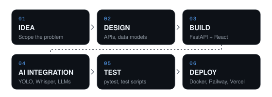

Live demos: <a href="https://roadvision-ai.up.railway.app">RoadVision AI</a> · <a href="https://ai-life-manager-two.vercel.app">AI Life Manager</a> · <a href="https://midnight-munchies-dashboard-bhaskar.streamlit.app/">Midnight Munchies</a>

## About

I'm an Information Science Engineering student focused on building practical AI-powered and full-stack applications. I like taking an idea all the way to a working product: computer vision systems, LLM and speech applications, FastAPI backends and React interfaces, deployed so people can actually use them.

## Featured Projects

  
   
  <a href="https://github.com/bhaskibhaskar007/RoadVision-AI">View Project</a> &nbsp;·&nbsp; <a href=https://roadvision-ai.up.railway.app>Live Demo</a>

  
   
  <a href="https://github.com/bhaskibhaskar007/ai-life-manager">View Project</a> &nbsp;·&nbsp; <a href=https://ai-life-manager-two.vercel.app>Live Demo</a>

  
   
  <a href="https://github.com/bhaskibhaskar007/AI-meeting-summarizer">View Project</a>

  
   
  <a href="https://github.com/bhaskibhaskar007/AI-Object-Detection">View Project</a>

  
   
  <a href="https://github.com/bhaskibhaskar007/QR-Emergency-System">View Project</a>

  
   
  <a href="https://github.com/bhaskibhaskar007/midnight-munchies-dashboard">View Project</a> &nbsp;·&nbsp; <a href=https://midnight-munchies-dashboard-bhaskar.streamlit.app/>Live Demo</a>

## What I Build

<table>
  <tr>
    <td width="50%" valign="top"> <b>AI Applications</b> LLM tool-use and speech-to-summary apps <code>Whisper</code> <code>Transformers</code> <code>FastMCP</code></td>
    <td width="50%" valign="top"> <b>Computer Vision</b> Object detection and QR scanning pipelines <code>YOLO</code> <code>OpenCV</code></td>
  </tr>
  <tr>
    <td valign="top"> <b>Backend Systems</b> REST APIs with auth and database migrations <code>FastAPI</code> <code>SQLAlchemy</code> <code>Alembic</code></td>
    <td valign="top"> <b>Full-Stack Products</b> Typed interfaces wired to real APIs <code>React</code> <code>TypeScript</code> <code>Vite</code></td>
  </tr>
  <tr>
    <td valign="top"> <b>AI Integrations</b> Models and LLM tools served behind web apps <code>PyTorch</code> <code>Pydantic</code> <code>JWT</code></td>
    <td valign="top"> <b>Developer Tools</b> GUI and CLI utilities, containers, test suites <code>Tkinter</code> <code>Docker</code> <code>pytest</code></td>
  </tr>
</table>

## How I Build

## Tech Stack

<table>
  <tr><td><b>AI / ML</b></td><td>Python · PyTorch · YOLO · OpenCV · Transformers · Whisper</td></tr>
  <tr><td><b>Backend</b></td><td>FastAPI · REST APIs · Pydantic · SQLAlchemy</td></tr>
  <tr><td><b>Frontend</b></td><td>React · TypeScript · Vite · Tailwind CSS</td></tr>
  <tr><td><b>Data</b></td><td>PostgreSQL · SQLite</td></tr>
  <tr><td><b>Tools / Deployment</b></td><td>Git · GitHub · Docker · Streamlit · Railway · Vercel</td></tr>
</table>

## GitHub

  
  

  <picture>
    <source media="(prefers-color-scheme: dark)" srcset="https://raw.githubusercontent.com/bhaskibhaskar007/bhaskibhaskar007/output/snake-dark.svg">
    <source media="(prefers-color-scheme: light)" srcset="https://raw.githubusercontent.com/bhaskibhaskar007/bhaskibhaskar007/output/snake.svg">
    
  </picture>

## Currently Learning

AI Engineering · Computer Vision · LLM Applications · Backend Architecture · Production AI Systems · Cloud Deployment

## Let's Connect

Interested in AI, computer vision, full-stack development, or building something useful? Let's talk.

<!-- Add when ready, then delete this comment:

-->

Building practical AI systems, one idea at a time.

